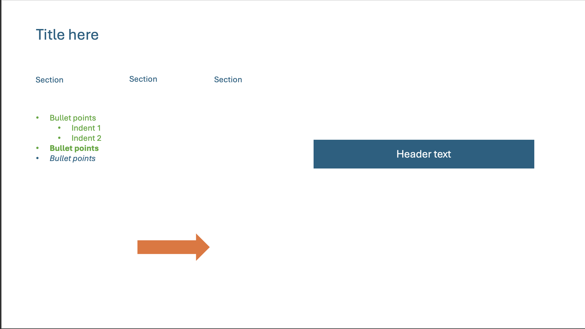

Syncfusion JSON to React Conversion Documentation

1. Python Script for Conversion

The provided Python script (app.py) converts Syncfusion PowerPoint JSON data into React components. The script follows these steps:

Parsing the JSON: The script reads the Syncfusion PowerPoint JSON file and extracts the necessary components using Pydantic models for validation.

Generating JSX Elements: Based on the extracted data, it maps each Syncfusion shape and text property to an equivalent React JSX structure.

Applying Styling: The script generates inline styles in JSX to retain the position, font, colors, and alignment from the original Syncfusion JSON.

Handling Shapes and Formatting:

Converts AutoShapes (e.g., rectangles, arrows, circles) to 
 elements with proper styling.

Handles text formatting, including font properties, alignment, and list formats.

Processes line and fill styles for shapes.

Supports image-based shapes by embedding base64 image data or external URLs.

Generating the Final React Component: The output is a structured React component (SyncfusionSlide.jsx) that represents the slide layout and formatting.

2. Mapping Between Syncfusion and React Concepts

| Syncfusion JSON Property       | React Equivalent Component/Style |
|--------------------------------|----------------------------------|
| `SlideItemType: AutoShape`     | `
` element with styled properties |
| `AutoShapeType: Rectangle`     | `
` with `backgroundColor`, `borderRadius: 0` |
| `AutoShapeType: RightArrow`    | `
` with `clip-path` for arrow shapes |
| `TextBody.Paragraphs.Text`     | `` inside `
` for text elements |
| `Font.FontSize`                | `fontSize` in CSS (converted to `px`) |
| `Font.Color`                   | `color` property in JSX |
| `Font.Bold`                    | `fontWeight: 'bold'` |
| `Font.Italic`                  | `fontStyle: 'italic'` |
| `ListFormat.BulletCharacter`   | Bullet styling using CSS `margin-left` for indentation |
| `FillFormat.Color`             | `backgroundColor` property for shapes |
| `LineFormat.Color`             | `borderColor` property for outlines |
| `LineFormat.Width`             | `borderWidth` property |

3. Assumptions and Limitations

Assumptions:

The JSON structure follows the standard Syncfusion PowerPoint JSON format.

Fonts and colors in Syncfusion JSON are directly translatable to CSS.

Shapes are absolute positioned within a div representing the slide container.

Each slide element has a unique ShapeId to avoid rendering conflicts.

Limitations:

Complex shapes (e.g., gradients, patterns) may not be fully supported.

Charts and SmartArt are not fully implemented in React and require additional libraries.

Some font families used in Syncfusion may not be available in web-safe fonts.

Text wrapping and overflow behavior may differ from PowerPoint's rendering.

Clip-path-based shapes (e.g., arrows) might not be fully cross-browser compatible.

Circular references in the JSON (if any) are logged but skipped from conversion.

Future Enhancements:

Support for additional shape types with SVG rendering.

Integration with charting libraries like Recharts for PowerPoint chart elements.

Improved layout adaptation for dynamic resizing in responsive designs.

Results

# Sample Slide

# React Page Rendering

